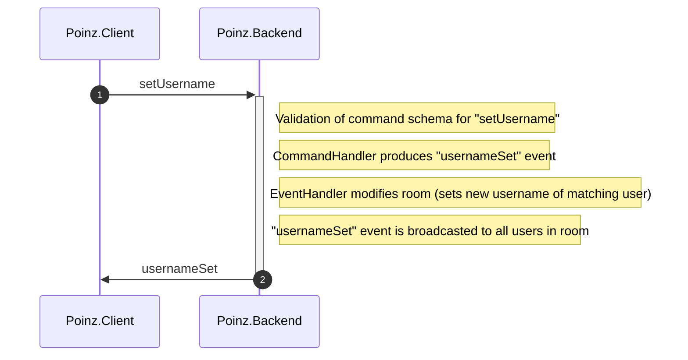

```mermaid
sequenceDiagram
  autonumber
  participant Poinz.Client
  participant Poinz.Backend
  Poinz.Client->>+Poinz.Backend: setUsername
  Note right of Poinz.Backend: Validation of command schema for "setUsername"
  Note right of Poinz.Backend: CommandHandler produces "usernameSet" event
  Note right of Poinz.Backend: EventHandler modifies room (sets new username of matching user)
  Note right of Poinz.Backend: "usernameSet" event is broadcasted to all users in room
  Poinz.Backend->>-Poinz.Client: usernameSet
```
