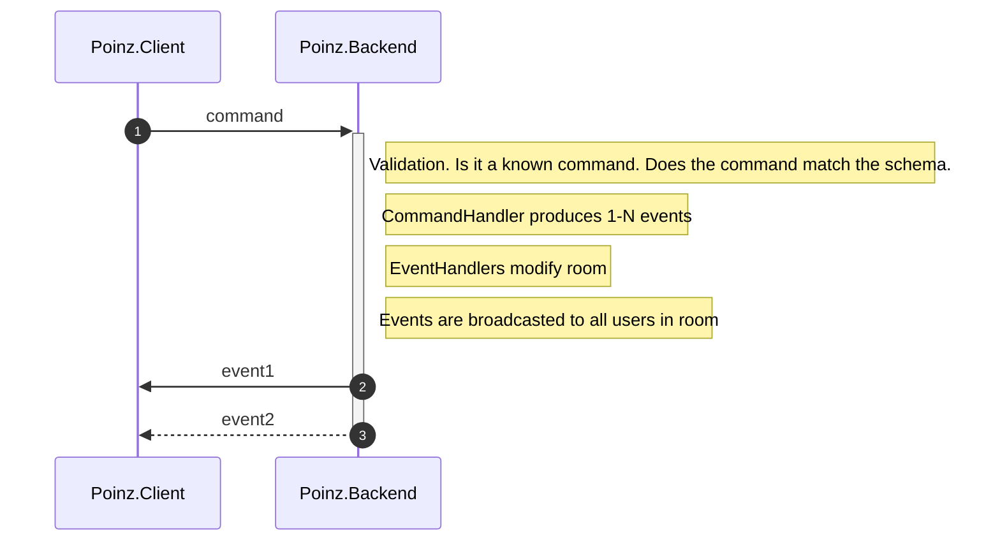

```mermaid
sequenceDiagram
  autonumber
  participant Poinz.Client
  participant Poinz.Backend
  Poinz.Client->>+Poinz.Backend: command
  Note right of Poinz.Backend: Validation. Is it a known command. Does the command match the schema.
  Note right of Poinz.Backend: CommandHandler produces 1-N events
  Note right of Poinz.Backend: EventHandlers modify room
  Note right of Poinz.Backend: Events are broadcasted to all users in room
  Poinz.Backend->>Poinz.Client: event1
  Poinz.Backend-->>-Poinz.Client: event2
```
